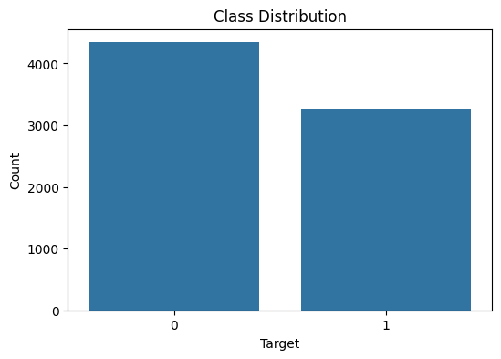
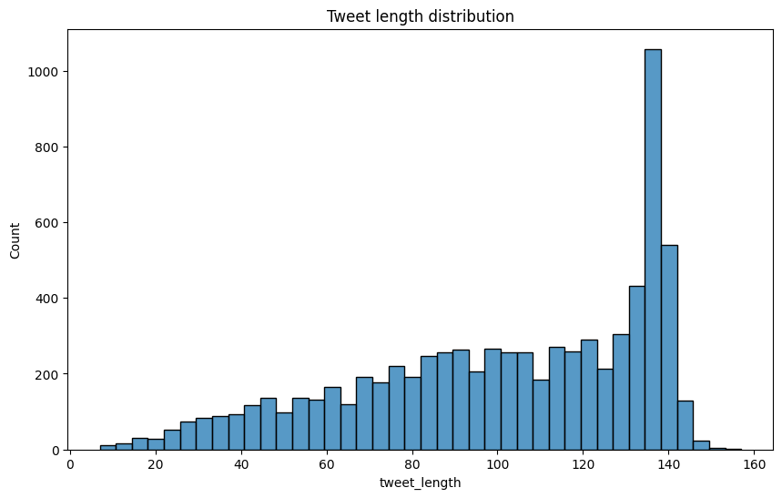
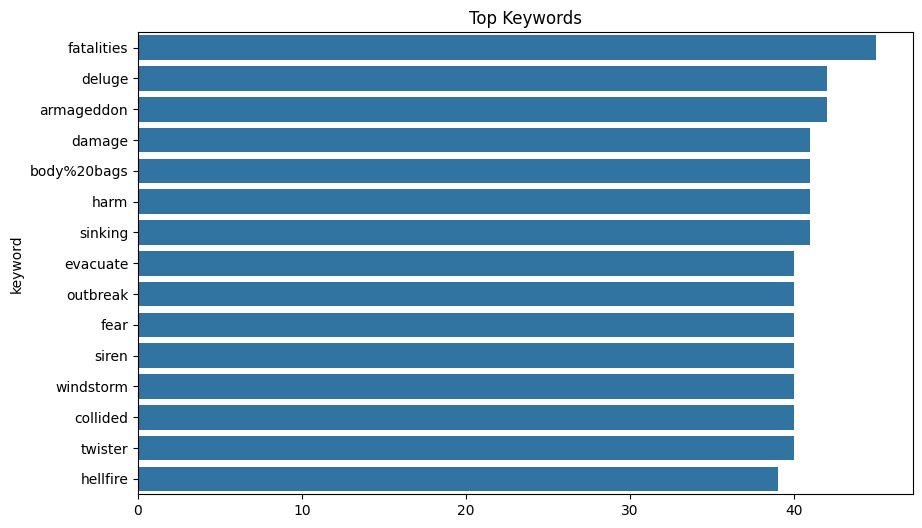
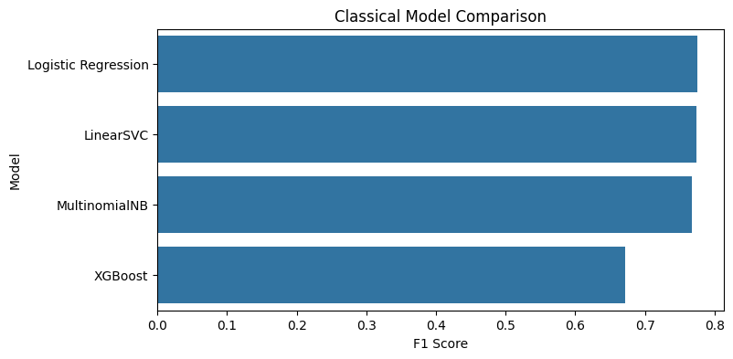
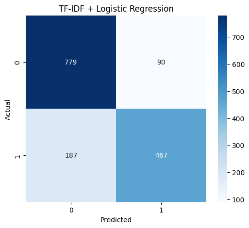
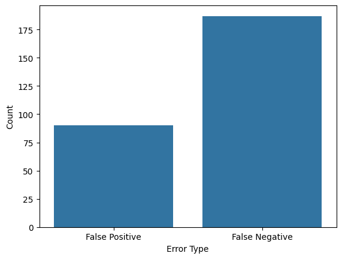
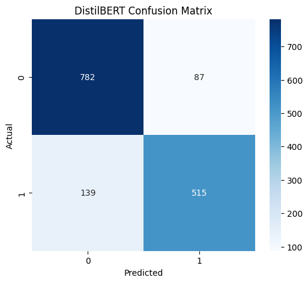

# Disaster Tweet Detection

> NLP project for disaster tweet classification using classical machine learning and transformer-based models.

## Overview

This project addresses the Kaggle competition **NLP with Disaster Tweets**.

The objective is to classify tweets into:

- **Disaster (1)**
- **Non-Disaster (0)**

The project was developed as a complete NLP pipeline rather than a leaderboard-focused solution. It includes:

- Exploratory Data Analysis (EDA)
- TF-IDF feature engineering
- Classical ML baselines
- Error analysis
- DistilBERT fine-tuning
- Model comparison
- Streamlit demo application

---

## Dataset

Source:

- Kaggle: NLP with Disaster Tweets

Dataset fields:

| Column | Description |
|----------|----------|
| id | Tweet ID |
| keyword | Disaster-related keyword |
| location | User location |
| text | Tweet text |
| target | Label (0/1) |

Target distribution:



### Key observations

- The dataset is relatively balanced.
- `keyword` contains missing values.
- `location` contains many missing values.
- Tweets are generally short.

---

# Exploratory Data Analysis

## Tweet Length Distribution



Most tweets are relatively short, which makes transformer-based approaches computationally efficient.

---

## Most Frequent Keywords



Several keywords are strongly associated with disaster-related events:

- earthquake
- flood
- wildfire
- evacuation
- explosion

---

# Classical NLP Baseline

## Feature Engineering

Tweets were converted into TF-IDF vectors using:

- Unigrams
- Bigrams
- English stopword removal

---

## Models Evaluated

Several classical machine learning models were tested:

| Model | Validation F1 |
|---------|---------|
| Logistic Regression | 0.775 |
| LinearSVC | 0.772 |
| XGBoost | 0.769 |
| MultinomialNB | 0.758 |

### Classical Model Comparison



### Selected Baseline

Logistic Regression was chosen because it achieved the strongest performance while remaining highly interpretable.

---

## TF-IDF Confusion Matrix



---

# Error Analysis

Error analysis was performed to understand the limitations of sparse text representations.

## Error Distribution



### Common False Positives

Examples:

```text
my heart exploded
farts that creates an earthquake
Super Freestyle Explosion Live in Concert
```

These tweets contain disaster-related vocabulary but do not describe actual disaster events.

### Common False Negatives

Examples:

```text
hostage situation
refugee crisis
kidnapped in Cairo
```

These tweets often describe real disaster-related situations indirectly and lack strong lexical signals.

### Key Findings

TF-IDF models:

- rely heavily on keywords
- struggle with figurative language
- cannot capture contextual meaning
- frequently misclassify ambiguous tweets

These observations motivated the use of transformer-based architectures.

---

# DistilBERT

## Motivation

Classical bag-of-words approaches ignore context.

DistilBERT was fine-tuned to capture semantic relationships between words and improve robustness on ambiguous tweets.

Model:

```python
distilbert-base-uncased
```

---

## DistilBERT Results

| Model | Validation F1 |
|---------|---------|
| DistilBERT | **0.823** |

---

## DistilBERT Confusion Matrix



---

# Final Model Comparison

| Category | Model | F1 Score |
|-----------|---------|---------|
| Classical ML | Logistic Regression | 0.775 |
| Transformer | DistilBERT | **0.823** |

### Improvement

DistilBERT improved validation F1 by approximately **5 percentage points** over the strongest classical baseline.

---

# Project Structure

```text
disaster-tweet-detection/
│
├── data/
│   ├── train.csv
│   └── test.csv
│
├── notebooks/
│   ├── 01_eda.ipynb
│   ├── 02_tfidf_baseline.ipynb
│   ├── 03_error_analysis.ipynb
│   └── 04_distilbert.ipynb
│
├── models/
│   └── distilbert/
│
├── app/
│   └── streamlit_app.py
│
├── images/
│
├── requirements.txt
│
└── README.md
```

---

# Streamlit Demo

The project includes a simple web application for manual inference.

### Features

- Enter a tweet
- Get a prediction
- View confidence scores

### Demo


Run locally:

```bash
streamlit run app/streamlit_app.py
```

---

# Reproducibility

Install dependencies:

```bash
pip install -r requirements.txt
```

Run notebooks in order:

```text
01_eda.ipynb
02_tfidf_baseline.ipynb
03_error_analysis.ipynb
04_distilbert.ipynb
```

---

# Key Takeaways

- TF-IDF + Logistic Regression provides a strong NLP baseline.
- Error analysis reveals the limitations of sparse representations.
- DistilBERT improves performance through contextual understanding.
- Transformer-based models are more robust to figurative and ambiguous language.

---

# Future Work

Possible improvements:

- RoBERTa fine-tuning
- DeBERTa fine-tuning
- Hyperparameter optimization
- Cross-validation
- Public deployment
- Batch inference support